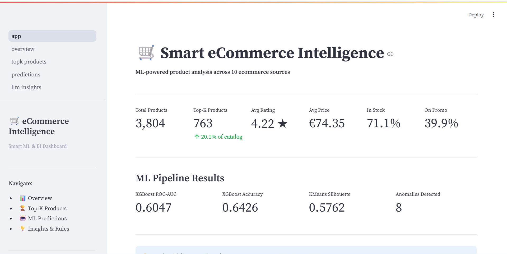
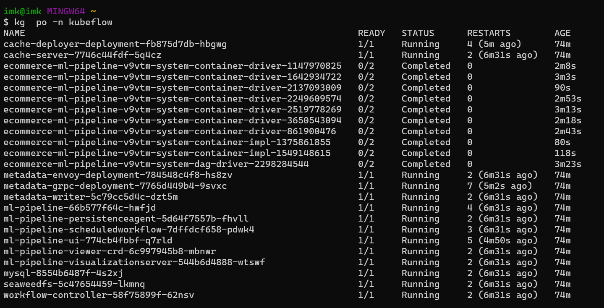
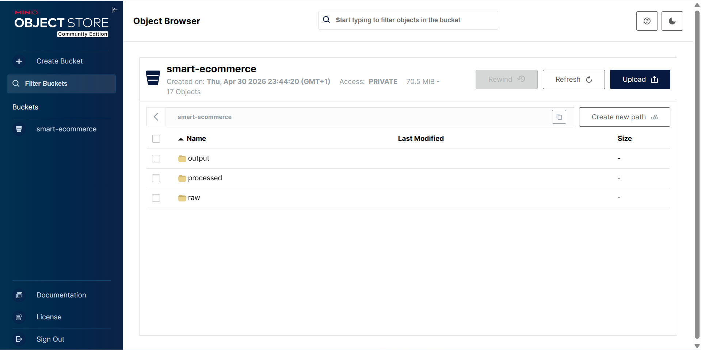
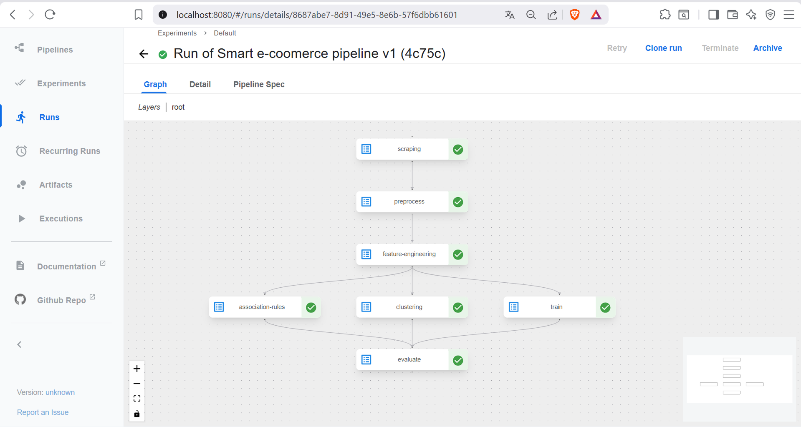
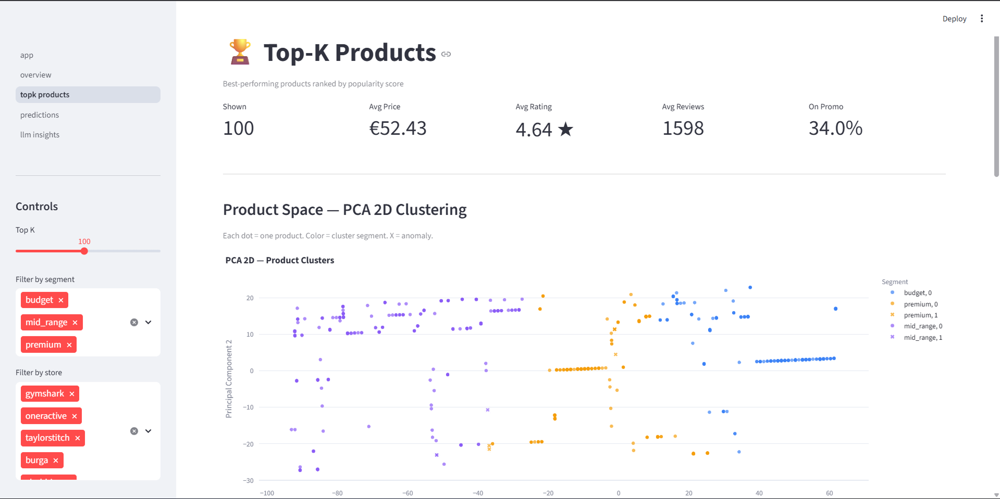

# Smart eCommerce Intelligence


## Description

Smart eCommerce Intelligence est un projet d’intelligence commerciale et ML pour l’e-commerce. Il intègre:

- un module de collecte de données produits depuis Shopify et WooCommerce
- un pipeline ML reproductible orchestré avec Kubeflow et Kubernetes
- une persistence de données via MinIO
- un dashboard Streamlit pour visualiser les résultats
- une couche LLM pour enrichissement, synthèse et recommandations

Le projet est conçu selon des principes DevOps/MLOps : conteneurisation, orchestration Kubernetes, stockage objet, et séparation claire des responsabilités.

---
## Visualisations du projet :
### Représentation globale du système

*Figure 1 : Diagramme global du système montrant le fonctionnement de la plateforme, les technologies utilisées, ainsi que l’infrastructure mise en place (data pipeline, stockage, orchestration et services).*


---

### Vue d’ensemble du système

*Figure 2 : Architecture globale du système smart e-commerce.*

---

### Insights LLM

*Figure 3 : Résultats et analyses générés par le modèle LLM.*

---

### Kubeflow Pods

*Figure 4 : Pods en cours d’exécution dans Kubeflow.*

---

### MinIO Storage

*Figure 5 : Interface de stockage des données avec MinIO.*

---

### Pipeline

*Figure 6 : Pipeline de traitement des données.*

---

### Top-K Results

*Figure 7 : Résultats Top-K retournés par le système.*

## Architecture

### 1. Collecte de données (Agents A2A)

- `agents/agent_coordinator.py` : orchestration des agents
- `agents/shopify_agent.py` : extraction des produits depuis Shopify
- `agents/woocommerce_agent.py` : accès WooCommerce via API REST
- `agents/simple_api_agent.py` : exemples d’intégration API
- `agents/schemas.py` : validation Pydantic des données produits

### 2. Stockage et persistance

- `storage.py` : gestion locale et MinIO
- Un bucket MinIO `smart-ecommerce` est utilisé pour stocker `raw/`, `processed/` et `output/`
- `docker-compose.yml` configure MinIO + agents + pipeline + dashboard
- `infra/k8s/minio.yaml` expose MinIO sur Kubernetes avec PVC

### 3. Pipeline ML et orchestration

- `pipeline/run_pipeline.py` : orchestrateur de bout en bout
- `pipeline/steps/preprocess.py` : préparation des données
- `pipeline/steps/feature_engineering.py` : création de features
- `pipeline/steps/train.py` : entraînement XGBoost
- `pipeline/steps/evaluate.py` : évaluation et rapport
- `pipeline/models/clustering.py` : segmentation et PCA
- `pipeline/models/association_rules.py` : règles d’association
- `pipeline/kubeflow_pipeline.py` : définition de pipeline Kubeflow

### 4. Visualisation BI

- `dashboard/app.py` : application Streamlit
- `dashboard/data_loader.py` : chargement des indicateurs et produits
- Pages BI : `dashboard/pages/01_overview.py`, `02_topk_products.py`, `03_predictions.py`, `04_llm_insights.py`

### 5. LLM et enrichissement

- `llm/llm_client.py` : wrapper LLM LangChain pour Groq + Gemini
- `llm/chains.py`, `llm/context_builder.py`, `llm/enrichment.py`, `llm/synthesis.py` : traitement des prompts et enrichissement
- Support des modèles LLM et de la stratégie MCP pour l’interfaçage responsable

---

## Technologies clés

- Python 3.x
- pandas, numpy, scikit-learn, xgboost, mlxtend
- Streamlit, Plotly
- MinIO pour stockage objets
- Docker + docker-compose
- Kubernetes + manifests YAML
- Kubeflow Pipelines
- LangChain + Groq/Gemini

---

## Fonctionnalités principales

- Extraction multi-source Shopify/WooCommerce/API
- Stockage persistant via MinIO
- Pipeline ML automatisé et reproductible
- Sélection Top-K produits et scoring multi-critères
- Clustering, détection d’anomalies, règles d’association
- Dashboard BI interactif
- Enrichissement par LLM et synthèses intelligentes
- Conception adaptée à Kubernetes et Kubeflow

---

## Installation et exécution

### Prérequis

- Python 3.11+
- Docker
- docker-compose
- Kubernetes (Minikube / Kind) si vous souhaitez déployer en K8s
- MinIO ou bucket compatible S3

### Installation locale

1. Créez un environnement virtuel :

```bash
python -m venv venv
venv\Scripts\activate    
```

2. Installez les dépendances :

```bash
pip install -r requirements.txt
```

3. Démarrez les services via Docker Compose :

```bash
docker compose up --build
```

4. Lancez le pipeline de données :

```bash
python pipeline/run_pipeline.py
```

5. Lancez le dashboard :

```bash
streamlit run dashboard/app.py
```

---

## Déploiement Kubernetes / Kubeflow

Le projet est déjà préparé pour Kubernetes :

- `infra/k8s/minio.yaml` : déploiement MinIO avec PVC
- `infra/k8s/agents-deployment.yaml`, `dashboard-deployment.yaml`, `pipeline-deployment.yaml` : services et ressources Kubernetes
- `pipeline/kubeflow_pipeline.py` : pipeline ML déployable sur Kubeflow

> Le stockage objet MinIO apporte une couche de persistance stable pour les artefacts de données et les résultats ML.

---

## Organisation des données (local + MinIO)

- `data/raw/` : données brutes collectées
- `data/processed/` : dataset nettoyé et ML-ready
- `data/output/` : résultats de modèles, KPI, fichiers CSV de reporting

---

## Revue technique rapide

### Points forts

- Architecture modulaire claire : agents, pipeline, dashboard, LLM
- Persistance objet via MinIO bien intégrée
- Orchestration Docker + Kubernetes + Kubeflow
- Définition d’un pipeline ML cohérente et reproductible
- Dashboard Streamlit aligné sur l’analyse produit
- Utilisation d’un wrapper LLM avec fallback

---


## Notes complémentaires

- Le projet utilise des bonnes pratiques DevOps : conteneurisation, séparation des responsabilités, orchestrateur centralisé.
- La persistance MinIO permet une adaptation naturelle à Kubernetes et à Kubeflow.
- Le projet est prêt pour une prochaine phase de productionnalisation : monitoring, tests, gestion avancée des secrets, normalisation des pipelines.

##  Contribution

Les contributions sont les bienvenues !

1. Fork le projet
2. Crée une branche (`git checkout -b feature/ma-fonctionnalite`)
3. Commit tes changements (`git commit -m 'feat: ajoute X'`)
4. Push la branche (`git push origin feature/ma-fonctionnalite`)
5. Ouvre une Pull Request

---

##  Licence

Ce projet est sous licence **MIT** — contacter [Mohamed Iliass Kaddar](mailto:moahmediliassk@gmail.com) ou [EL AZZOUZI Achraf](mailto:achraf0el7azzouzi@gmail.com). pour plus de détails.

---

<div align="center">
  <strong>Réalisé dans le cadre d'un projet académique DM & ML</strong><br>
  ML & DM · LangChain · MLOps · MCP · Clean Architecture
</div>
